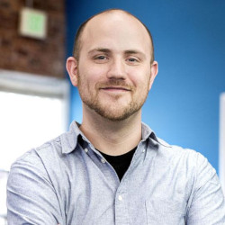

---?image=presentation/assets/ironman.jpg&opacity=20&size=cover

# Become a Developer Experience Superhero

@css[text-blue](Building Processes That Unlock Your Team's Potential)

---

Hi, I'm Dustin @emoji[wave]

@ul
- @DustinLeblanc on Twitter
- @dustinleblanc on Drupal.org...and pretty much everywhere else
- Senior Software Engineer @ Tandem
- Co-Maintainer of Lando
@ulend

---

## Overview

@ul
- Limiting the Scope of Your Operations
    * Setting Expectations Inside your Org
- Providing the Tools That Promote Success
- Keeping the Machine Accessible to the User
- Leveraging the "Free" Work of Machines
- Creating a Culture of Constant Improvement
@ulend

---

## Limiting the Scope of Your Operations

@ul
- Take stock of your technology inventory
    * What are your team members good at?
    * What technologies do they have experience with?
    * What service providers do you have relationships with?
- Automate Setup of your ideal technology
@ulend

---

### Defining Ideal Projects

@ul
- Able to host with preferred provider
- Able to start with team start states
- Able to use tools team is familiar with
- Adequate budget for standard team processes
- (optional): Business problems your team are familiar with
@ulend

---

### Setting Expectations Inside Your Org

@ul

- Equip your sales team with a picture of your ideal project
- Be explicit about the plan when conditions aren't ideal
- Define a Standard Issue Flow

@ulend

---

#### Handling Deviation

@ul

- Budget accordingly
- Adjust expected outcomes (estimate for overhead!)

@ulend

---

### Providing the Tools to Promote Success

@ul
- Workstation Configuration (Hyperdrive and Lando)
- Project start states with:
  * test / qa tools
  * Complete theme pipeline definition
  * complete development infrastructure
  * Clearly defined scripts for repeated tasks (pulling, syncing, compiling, testing)
  * Issue and pull request templates
  * CI Config
  * PaaS config
  * Good documentation
- Cloud tools (browserstack, etc)
@ulend

---

#### Workstation Configuration

[Hyperdrive](https://github.com/lando/hyperdrive) is an example of a workstation setup tool created by the creators of Lando. It provides:

@ul
- Easy setup of SSH Keys
- Easy setup / installation of Docker & Lando
- Easy setup of Lando's dev dependencies (NodeJS pinned do our dev version)
- Git
- All setup on pretty much any Debian based Linux distro and MacOS
@ulend

---

Other examples:

@ul
- [Thoughtbot](https://thoughtbot.com)'s [laptop/dotfiles/rcm](https://github.com/thoughtbot/laptop)
- [Tandem's Dotfiles](https://github.com/thinktandem/dotfiles) (which are based on Thoughtbot's dotfiles)
@ulend

---

#### Start states

There is an example start state for this presentation at https://github.com/TibanaDev/tibana-drupal

This presentation also lives in that repo.

Some other examples from Tandem:

@ul
- https://github.com/thinktandem/drupal8-template
- https://github.com/thinktandem/vuepress-template
@ulend

---

We'll dive into the example in this repository after the break and for the rest of the session.

---

### Keeping the Machine Accessible to User

@ul
- Try to write automation in the lingua franca of your team (PHP, JS)
- Encourage the team to contribute their learnings from each project
- Source rough edges in your current infrastructure from your team
- Assign parts of your systems to be maintained by team members
- Share your secrets with the world to stir up new ideas
@ulend

---

### Leveraging the "Free" Work of Machines

@ul
- Automate Your QA with:
  * Automated Testing for Mission Critical Features
  * Continuous Integration Services (Like TravisCI)
  * Code Complexity Services (like CodeClimate, and CI runs of PHPCS, PHPMD, etc)
- Workflow Automation of good PaaS providers (PlatformSH, Pantheon, Laravel Forge)
@ulend

---

### Creating a Culture of Constant Improvement

@ul
- Track infrastructure and process problems the same way you track bugs
- Collect new ideas for changes in the same way you track features
- Regularly schedule reviews to discuss those changes
@ulend

---

Let's Take a break!

---

Let's dive into an example start state

---
